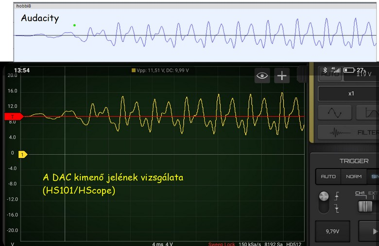

# DAC WAV player demo
## project name: mbed6_DAC_wavplayer
Tested by: **Keil Studio** 1.5.55 and **Mbed-OS** 6.16.0

This project demonstrates simple filesystem handling on an SD card
and the hobbi8.wav audio file read from the SD card is played by using the 
builtin DAC as audio output. For compatibility reason the FatFileySystem 
library is used (the LittleFileSystem and LittleFileSystem2 type filesystems
do not provide compatibility with oher operating systems like Windows, Linux or Mac OS). 

The program tries to mount the filesystem and to open a wav file (hobbi8.wav).
If it is a valid wav file having 8 bit audio samples then it will be played
through the DAC1 channels (the output is the pin PA_4).

We assume, that the wav file is a mono file, containing 8-bit unsifned 
auidio samples at sampling rate of 8 kHz. Of course, the program can be 
extended to accept different formats...

Besides the library modules available in Mbed API we have to 
import the AudioPlayer library as well (this library is containing
the WaveAudioStream object class what we actually need).


### References: 
* [mbed6_SD_filesystem](https://github.com/cspista/mbed6_SD_filesystem)
* [mbed6_DAC_sinewave](https://github.com/cspista/mbed6_DAC_sinewave)
* [mbed-os-audioplayer](https://github.com/ARMmbed/mbed-os-audioplayer) (ARM Mbed official library)
* [USB WAV audio player tutorial](https://os.mbed.com/docs/mbed-os/v6.15/apis/usb-wav-audio-player.html) (Mbed official example)

## Hardware requirements
* NUCLEO-F446RE development board
* SD card breakout (we used an 1.8" TFT board wich has an SD card socket on the back side)
* USB connection to a PC through the built-in ST-Link v2-1

## Wiring instructions for the NUCLEO-F446RE board

We selected the SPI3 channel for driving the SD card. 

| SD card | color | signal |pin   |
|:-------:|:----: |:-----:|:-------:|
|  DO    | blue   | MISO  | PC11    |
|  SCLK  | yellow | SCLK  | PC10    |
|  DI    | green  | MOSI  | PC12    |
|  CS    | brown  | CS    | PD2     |
|  VCC   | red    | VCC   | 5V/3.3V |
|  GND   | black  | GND   | GND     |


## Software requirements
* Start with an empty mbed 6 project
* Import the AudioPlayer libraray (URL: https://github.com/ARMmbed/mbed-os-audioplayer )
* Edit the main.cpp source file
* Configure the project by adding an **mbed_app.json** file in which
    * We have to add the **SD** component and the **STORAGE** features_add
    * We have to override the pin connections according to the selected **SPI** channel

Finally the **mbed_app.json** sholuld look like this: 

```
{
    "target_overrides": {
        "*": {
            "target.features_add": ["STORAGE"],
            "target.components_add": ["SD"],            
            "sd.SPI_MOSI" : "PC_12",
            "sd.SPI_MISO" : "PC_11",
            "sd.SPI_CLK"  : "PC_10",
            "sd.SPI_CS"   : "PD_2"
        }
    }
}
```
## mbed6_DAC_wavplayer results
In the following figure we compared the original signal (Audacity) 
with that of obtanied from the DAC output (PA:4 pin). The agreement is quite satisfactory.



**Note:** The vertical scale is in arbitrary units, actually the value of 20.0 corresponds to 3.3 V.
